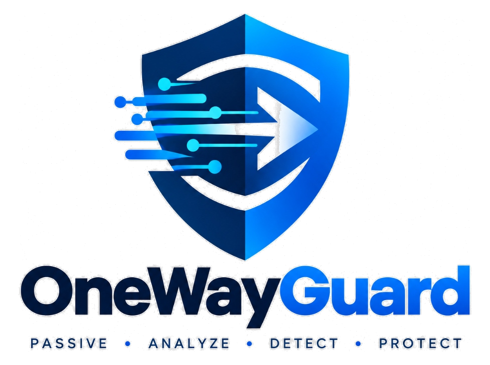

<p align="center">
  
</p>

# OneWayGuard — Platform Overview & Executive Brief

**OneWayGuard** is a **passive, defense-grade network threat analysis and forensic investigation platform** designed for secure enterprise networks, defense perimeters, and critical infrastructure (OT/ICS).

It inspects network traffic completely passively without transmitting any packets on the wire, using a fusion of machine learning and statistical signal filtering to detect active cyber threats in real time.

---

## 1. Core Mission & Design Principles

* **100% Passive / Zero-Transmit**:
  Engineered specifically for **Data Diodes, Optical TAPs, and SPAN/Mirror ports**. It never injects, blocks, responds to, or modifies traffic on the monitored network wire.
* **Privacy-Safe (No Payload Decryption)**:
  Analyzes only Layer 3 and Layer 4 flow timing, volume, packet dynamics, TCP flags, and connection metadata. It requires zero SSL/TLS decryption and never snoops on user payloads.
* **Autonomous & Air-Gapped**:
  Runs entirely on-premises on Windows without requiring cloud access, external API keys, or outbound telemetry.

---

## 2. Detection Engine Architecture

OneWayGuard processes packet data through a synchronized **5-stage detection pipeline**:

```text
               UNIDIRECTIONAL / TAP FEED
                          │
                          ▼
┌───────────────────────────────────────────────────────────┐
│  [Stage 1] Flow Reconstruction Engine                     │
│  - Reconstructs bidirectional 5-tuple IPv4 sessions       │
│  - Tracks timestamps, packet sizes & inter-arrival times  │
└─────────────────────────┬─────────────────────────────────┘
                          │
                          ▼
┌───────────────────────────────────────────────────────────┐
│  [Stage 2] Metadata Feature Extractor                     │
│  - Extracts Rate, IAT, SYN counts, payload ratios         │
│  - Evaluates DNS query domain entropy & packet dispersion │
└─────────────────────────┬─────────────────────────────────┘
                          │
            ┌─────────────┴─────────────┐
            ▼                           ▼
┌────────────────────────┐  ┌────────────────────────┐
│ [Stage 3] Kalman Bank  │  │ [Stage 4] XGBoost AI   │
│ - Continuous anomaly   │  │ - Hardened multi-class │
│   state tracking       │  │   gradient-boosted     │
│ - Rate & IAT drift     │  │   threat classifier    │
└───────────┬────────────┘  └───────────┬────────────┘
            │                           │
            └─────────────┬─────────────┘
                          ▼
┌───────────────────────────────────────────────────────────┐
│  [Stage 5] Score Fusion & Threat Attribution              │
│  - Dynamic fusion: 70% XGBoost ML + 30% Kalman Anomaly    │
│  - Filters benign jitter & eliminates false positives     │
│  - Emits structured SOC alerts with MITRE ATT&CK context  │
└─────────────────────────┬─────────────────────────────────┘
                          │
                          ▼
┌───────────────────────────────────────────────────────────┐
│  Defense-Grade Reporting & Live Visualization             │
│  - Real-time WebSocket Dashboard                          │
│  - Audit-Ready 5-Page DOCX & PDF Incident Reports         │
│  - Cryptographic SHA-256 Forensics Chain of Custody       │
└───────────────────────────────────────────────────────────┘
```

---

## 3. What Threats OneWayGuard Detects

| Threat Category | Description | Primary Detection Vectors |
|---|---|---|
| **C2 Beaconing** | Heartbeat callbacks to adversary command & control servers (Cobalt Strike, Mythic, Sliver). | Low-jitter periodic IAT signatures, recurring small payload ratios, fixed TCP window sizes. |
| **DGA & DNS Tunneling** | Algorithmic domain name lookups and DNS covert channels. | Character entropy analysis, lexical anomaly scoring, abnormal sub-domain query bursts. |
| **Reconnaissance & Port Scans** | Horizontal IP sweeps and vertical service port probes. | Elevated SYN flag counts with near-zero ACK/FIN ratios, high rate of distinct destination ports. |
| **Volumetric Anomalies & DDoS** | Resource exhaustion and bandwidth floods. | Sudden statistical divergence in packet arrival rates tracked by chi-square Kalman innovation gates. |
| **Data Exfiltration** | Unauthorized data staging and outbound leaks. | Asymmetric byte imbalances, extended outbound flow durations, continuous large-packet streams. |

---

## 4. Operational Modes

### Option A: Offline PCAP Forensics
* **Driver Required**: **None** (Zero drivers needed).
* **Use Case**: Forensic investigation, post-incident triage, threat hunting on historical captures.
* **How It Works**: Upload any standard `.pcap` or `.pcapng` file through the desktop dashboard. OneWayGuard parses packets directly from disk, runs XGBoost + Kalman inference, and populates forensic charts in seconds.

### Option B: Live Wire Monitoring
* **Driver Required**: **Npcap** (Windows NDIS 6 Light-Weight Filter driver).
* **Use Case**: Real-time passive wire sniffing on a physical network card, SPAN port, or optical TAP.
* **How It Works**: Connects to the designated physical network adapter via Npcap. Reads incoming packets in promiscuous mode without transmitting a single bit, refreshing forensic metrics and live threat alerts every second via WebSockets.

---

## 5. Automated Defense-Grade Reporting

With a single click from the dashboard or via API, OneWayGuard compiles executive incident reports in both **DOCX** and **PDF** formats formatted to international cyber defense standards:

1. **Section 1 — Executive Summary**: Threat posture rating, incident impact assessment, and high-level risk score.
2. **Section 2 — Incident Metadata & Evidence**: Monitored interface, capture duration, total flows, and cryptographic **SHA-256 integrity hash**.
3. **Section 3 — Detailed Threat Findings**: Attribution to MITRE ATT&CK techniques, confidence ratings, and behavioral evidence.
4. **Section 4 — Chronological Event Timeline**: Step-by-step reconstruction of adversary actions on the wire.
5. **Section 5 — SOC Remediation Guidance**: Actionable mitigation protocols, host isolation recommendations, and firewall rule templates.

---

## 6. Technical Specifications

* **Operating System**: Windows 10 (64-bit) / Windows 11 (64-bit).
* **Core Runtime**: Standalone Windows Executable (Self-contained Python 3.12 runtime, FastAPI, XGBoost, Scikit-Learn, PyArrow, Scapy).
* **Startup Performance**: **1.7 seconds** (Sub-second parallel window launch).
* **Security & Compliance**: Digitally signed with Authenticode SHA-256 certificate and DigiCert RFC 3161 timestamp.
